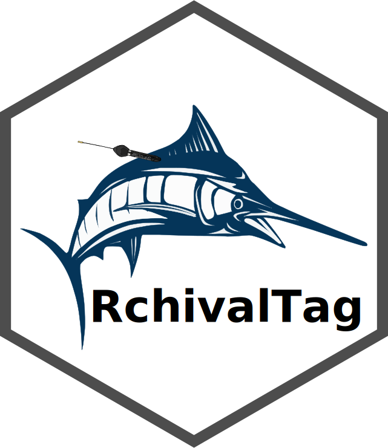
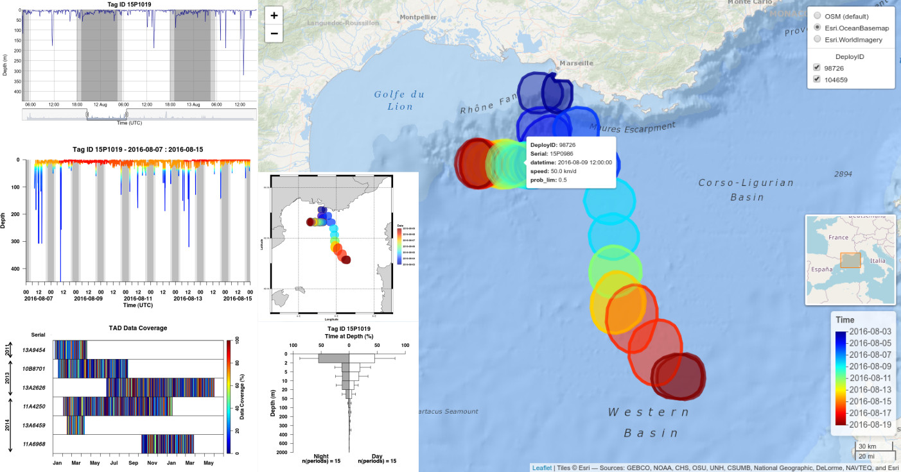

  

<h4 align="center">An R-Package for Analyzing and Interactive Visualization of Archival Tagging Data.</h4>

  <a href="#author">Author</a> •
  <a href="#description">Description</a> •
  <a href="#key-features">Key Features</a> •
  <a href="#tutorial">Tutorial</a> •
  <a href="#credits">Credits</a> •
  <a href="#related">Related</a> •
  <a href="#license">License</a>

## Author

[Dr. Robert Bauer | Fishery Biologist & Data Scientist](https://scholar.google.com/citations?hl=en&user=J-0_tdbR2tgC)

## Description

RchivalTag provides a toolbar of functions to analyze and visualize different data products from Archival Tags (Supported Models include amongst others: MiniPAT, sPAT, mk10, mk9 from [Wildlife Computers](http://wildlifecomputers.com/) as well as [LOTEK](https://www.lotek.com/products/psat-series) PSAT Models. Models from other Manufactorers might be supported as well.

## Key Features

* *readhistos()*, *read_PDT()*, *read_TS()*, *get_geopos()*: read in functions for different archival tag data products

* *ts2histos()*, *bin_TempTS()*, *get_thermalstat()*: Data conversion tools

* *plot_Depth()*, *plot_DepthTS()*, *plot_DepthTempTS()*, *dy_DepthTS()*: Interactive (Depth) time series data plots (related package: [dygraphs](https://rstudio.github.io/dygraphs/))

* *hist_tat()* and *hist_tad()*: Time-at-Depth (TaD) and Time-at-Temperature (TaT) fequency plots

* *image_TempDepthProfiles()*: Depth Temperature profiles (low resolution time series data) plots, inclduding PDT (PAT-style Depth Temperature profiles)

* *ggplot_geopos()*, *ggplotly_geopos()* and *leaflet_geopos()*: (Interactive) plotting functions for geolocation estimates (related packages: [oceanmap](https://github.com/rkbauer/R_Package_oceanmap), [ggplot2](https://ggplot2.tidyverse.org/), [plotly](https://plotly.com/r/), [leaflet](https://rstudio.github.io/leaflet/))

* *abacus_plot()* and *plot_data_coverage()*: Data coverage abacus plots for different data products

These functions were written to facilitate data handling and visualizations, so that within 2-3 lines of code the user can obtain figures that are ready for publication.

## Tutorial

You can find [here](https://github.com/rkbauer/R_Tutorial_Analyzing_Fish_Telemetry_Data_with_RchivalTag) an extensive online tutorial that covers the different functionalities of the package.

## Credits

This package was developed during my PhD thesis at the [IFREMER](\link{https://wwz.ifremer.fr/) and a Postdoc at [IRD](https://www.ird.fr/), which are both part of the [MARBEC lab](http://www.umr-marbec.fr). ggplot-based functions as well as interactive options have been added since.

## Related libraries

- [oceanmap](https://github.com/rkbauer/R_Package_oceanmap) - A R-Package to map oceanographic data.
- [plotly](https://plotly.com/r/) - An open source library for interactive figures.
- [dygraphs](https://rstudio.github.io/dygraphs/) - An R interface to the interactive dygraphs JavaScript charting library.
- [leaflet](https://rstudio.github.io/leaflet/) - A JavaScript-based map widget that can be rendered on HTML pages generated from R Markdown, Shiny, or other applications.

## You may also like...

- [IRATER](https://cran.r-project.org/web/packages/IRATER/index.html) - A R Interface for the Instantaneous RATEs (IRATE) Model to assess band recovery (conventional tagging) data (i.e. age-dependent or independent fishing and natural mortality rates).
- [oceanmap](https://github.com/rkbauer/R_Package_oceanmap) - A R-Package to map oceanographic data.
- [marine biologging](https://www.facebook.com/marine.biologging) - An online campaign for electronic tagging studies

## References

- Bauer, R., F. Forget and JM. Fromentin (2015) Optimizing PAT data transmission: assessing the accuracy of temperature summary data to estimate environmental conditions. Fisheries Oceanography, 24(6): 533-539, doi: [10.1111/fog.12127](https://doi.org/10.1111/fog.12127)

- Bauer, R., JM. Fromentin, H. Demarcq and S. Bonhommeau (2017) Habitat use, vertical and horizontal behaviour of Atlantic bluefin tuna (*Thunnus thynnus*) in the Northwestern Mediterranean Sea in relation to oceanographic conditions. Deep-Sea Research Part II: Topical Studies in Oceanography, 141: 248-261, doi: [10.1016/j.dsr2.2017.04.006](https://doi.org/10.1016/j.dsr2.2017.04.006)

- Bauer, R., F. Forget, JM. Fromentin and M. Capello (2020) Surfacing and vertical behaviour of Atlantic bluefin tuna (*Thunnus thynnus*) in the Mediterranean Sea: implications for aerial surveys. ICES Journal of Marine Science, 77(5): 1979-1991, doi: [10.1093/icesjms/fsaa083](https://doi.org/10.1093/icesjms/fsaa083)

## Visit my work on
>  [GitHub](https://github.com/rkbauer/) &nbsp;&middot;&nbsp;
>  [Google Scholar](https://scholar.google.com/citations?hl=en&user=J-0_tdbR2tgC) &nbsp;&middot;&nbsp;
>  [ResearchGate](https://www.researchgate.net/profile/Robert-Bauer-13) &nbsp;&middot;&nbsp;

